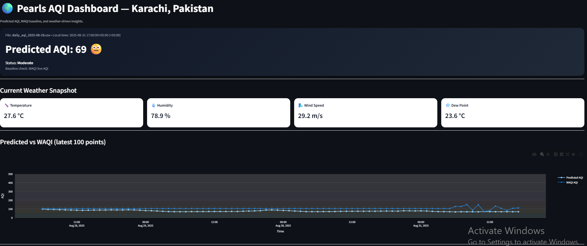

# AQIPM AQI Predictor

[](https://www.python.org/)
[](https://streamlit.io/)
[](https://github.com/NoorJehan20/aqi-pm25-collector/commits/main)
[](LICENSE)
[](https://your-app-link)

---

## Overview

**AQIPM (Air Quality Index Prediction Model)** is an interactive dashboard and machine learning project that predicts the Air Quality Index (AQI) based on PM2.5 and other pollutant data. It allows users to monitor air quality in Karachi with real-time predictions and trend visualizations.

---

## Features

- Real-time AQI prediction for Karachi using historical pollutant data  
- Multi-pollutant analysis: PM2.5, O₃, CO, NO₂, SO₂  
- Interactive dashboard via `app.py`  
- Automated data fetching using `pm25_fetcher.py`  
- Realtime predictions via `realtime_pred.py`  
- ML models: XGBoost (`best_model_xgboost_new.pkl`) and feature-engineered datasets (`feat_eng.csv`)  

---

## Demo

  
*Screenshot of AQIPM dashboard showing predicted AQI and pollutant trends.*

**Live Demo (if hosted)**: [Try AQIPM Predictor](https://your-app-link)  

---

## Installation

1. **Clone the Repository**

```bash
git clone https://github.com/NoorJehan20/aqi-pm25-collector.git
cd aqi-pm25-collector
````

2. **Create a Virtual Environment**

```bash
python -m venv venv
```

3. **Activate the Virtual Environment**

* Windows: `.\venv\Scripts\activate`
* macOS/Linux: `source venv/bin/activate`

4. **Install Dependencies**

```bash
pip install -r requirements.txt
```

---

## Running the Dashboard

```bash
streamlit run app.py
```

Open the URL provided by Streamlit (usually `http://localhost:8501`) in your browser.

---

## Project Structure

```
aqi-pm25-collector/
│
├── app.py                 # Main Streamlit dashboard
├── model_train.py         # Model training script
├── merge_hourly_to_daily.py # Data preprocessing script
├── pm25_fetcher.py        # Fetches PM2.5 and pollutant CSVs from GitHub
├── realtime_pred.py       # Script for realtime AQI prediction
├── best_model_xgboost_new.pkl # Trained XGBoost model
├── feat_eng.csv           # Feature-engineered dataset
├── requirements.txt       # Python dependencies
├── .github/workflows/     # GitHub Actions workflows
├── outputs/               # Outputs from latest runs
└── README.md              # Project documentation
```

---

## Data Sources

* Historical pollutant and AQI data fetched automatically from GitHub via `pm25_fetcher.py`
* Data is merged and processed for model training and realtime prediction

---

## Contributing

Contributions are welcome!

1. Fork the repository
2. Create a new branch (`git checkout -b feature-name`)
3. Make your changes
4. Commit your changes (`git commit -am 'Add new feature'`)
5. Push to the branch (`git push origin feature-name`)
6. Create a Pull Request

---

## Future Enhancements

* Multi-city AQI prediction
* Extend forecasts to 7+ days
* Mobile-friendly dashboard version
* Incorporation of weather features for improved accuracy

---

## License

This project is licensed under the MIT License. See the [LICENSE](LICENSE) file for details.

```
